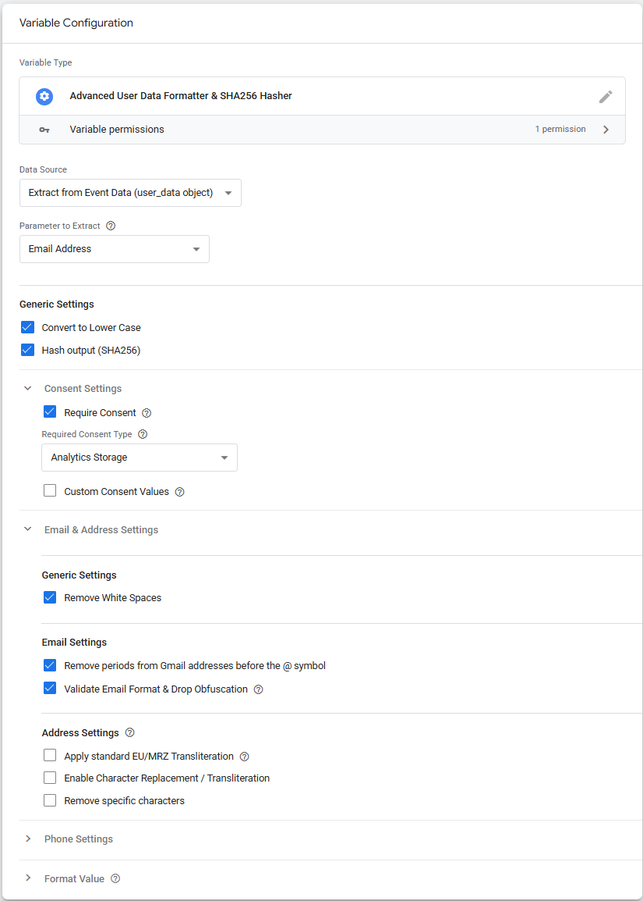
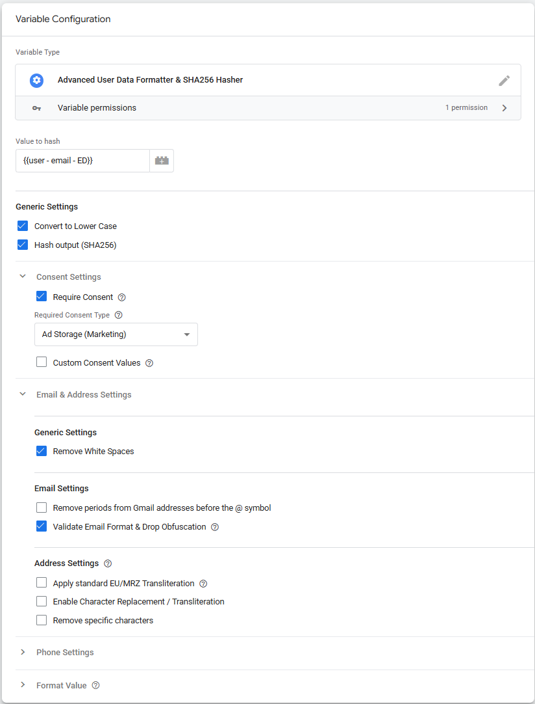
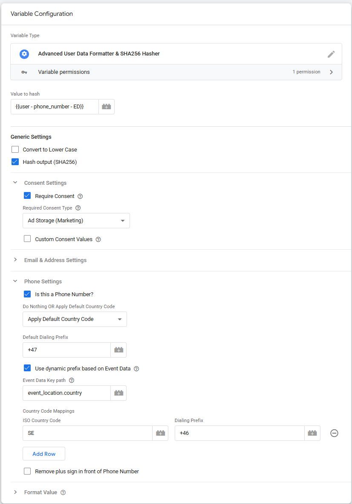
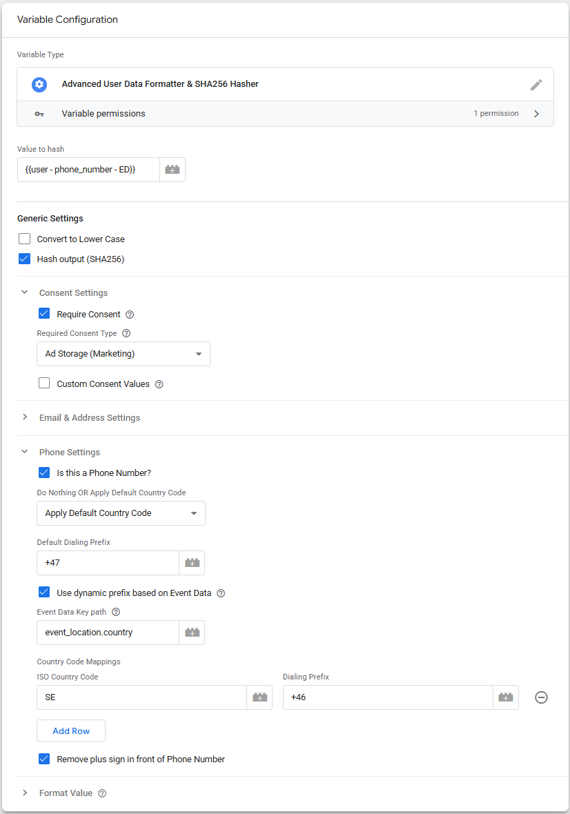
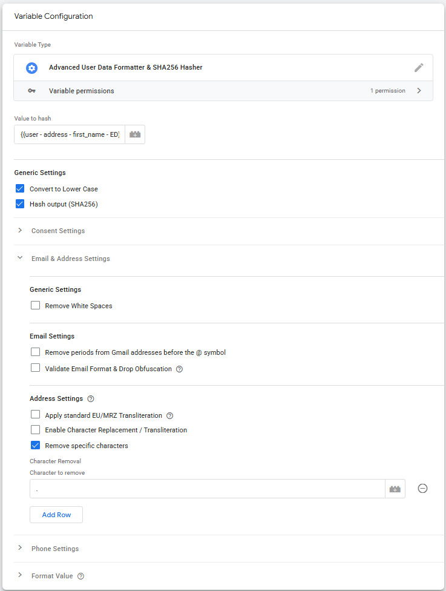
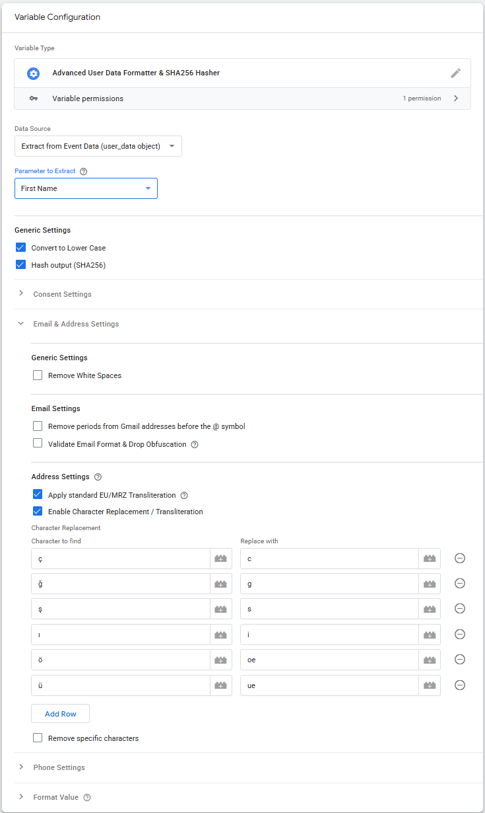

# Advanced User Data Formatter & SHA256 Hasher - SGTM Variable (Server)

An enterprise-grade Variable Template for Server-Side Google Tag Manager (sGTM) designed to normalize, transliterate, and securely SHA256-hash User Data (Customer Information Parameters).

Built to maximize Event Match Quality (EMQ) across Meta, Google, TikTok, Snapchat and others by handling the invisible data-hygiene errors that kill conversion attribution, while keeping your data architecture strictly privacy-compliant.

## Why Hash in Server-Side GTM?

When sending User Data to analytics or ad networks, you generally have three architectural choices. This template utilizes the **third** method, which provides the best balance of data security and agility.

1. **Clear Text to Vendor**: You send raw emails/phones directly from the browser to the ad network's API, and they hash it on their end.
	* **Risk**: Clear text personal data leaves your owned infrastructure, and may violate strict corporate infosec policies and exposing data to third-party tracking scripts.
2. **Pre-Hashed by the Web Backend**: Your web server hashes the data before the page loads and pushes the hash into the frontend.
	* **Pro**: Highly secure as clear text never hits the browser. 
	* **Con**: It is impossible to debug. If your backend hashes a poorly formatted phone number (e.g., missing a country code), you cannot see the error, and the ad network rejects it silently. Fixing formatting rules requires backend developer tickets.
3. **Hashed in Server-Side GTM (This Template)**: Data is sent securely from the browser to your owned Server Container in clear text. SGTM normalizes it perfectly, hashes it, and forwards the opaque hash to the receiver.

### Advantages of Hashing It Yourself in SGTM:

* **Total Data Sovereignty**: Clear text personal data never touches a third-party ad server. You maintain 100% control over the data pipeline.
* **Ultimate Debuggability**: Because the data arrives at your server in clear text, you can use the SGTM Preview Mode to inspect the raw string, verify the formatting rules worked perfectly, and ensure the data is pristine before the template turns it into an irreversible hash.
* **Marketing Agility**: Normalizing data (like stripping Gmail dots or translating ø to oe) could be difficult to enforce in backend databases. Doing it centrally on the server container allows analytics teams to adapt to new vendor rules instantly, without waiting on backend developer resources.

## Features Overview

* **Text & Email Normalization**: Trims whitespace, lowercases, and optionally strips periods from @gmail.com and @googlemail.com local addresses.
* **MRZ Name Transliteration**: Hardcoded dictionary safely transliterates European characters (e.g., æ ➔ ae, ø ➔ oe, é ➔ e) down to the standard English a-z alphabet recommended by Meta.
* **Custom Replacement Tables**: Simple UI tables allow you to define custom character replacements or removals for specific edge cases.
* **E.164 Auto-Prefixing**: Adds a default country code only when it's missing, intelligently stripping local leading zeros.
* **Dynamic Country Codes**: Map country ISO codes (like NO, SE, GB) from Event Data directly to their dialing prefixes (+47, +46, +44).

## How to Configure & Map Data

Because platforms have different rules, you should create separate variables for different data types.

### 1. Email Settings

This setup creates a globally compliant email hash optimized for match rates.

#### 1.1 Email Normalization (Google)

1. Create a new Variable using this template.
2. Select your raw Email variable as the Input.
3. Check **Convert to Lower Case**.
4. Check **Hash Output (SHA-256)**.
5. **Require Consent** settings (optional).
6. Check **Remove White Spaces**.
7. Check **Remove periods from Gmail addresses before the @ symbol**.
8. Check **Validate Email Format & Drop Obfuscation** (optional).

#### 1.2 Email Normalization (Meta, Snapchat, TikTok)

1. Create a new Variable using this template.
2. Select your raw Email variable as the Input.
3. Check **Convert to Lower Case**.
4. Check **Hash Output (SHA-256)**.
5. **Require Consent** settings (optional).
6. Check **Remove White Spaces**.
7. Check **Validate Email Format & Drop Obfuscation** (optional).

### 2. Phone Number Settings

If your phone number input is of good quality, you may skip some of the settings below.

#### 2.1 Phone Number: Google
Google require pure digits and a + sign.

1. Create a new Variable using this template.
1. Select your raw Phone variable as the Input.
3. Check **Hash Output (SHA-256)**.
4. **Require Consent** settings (optional).
5. Check **Is this a Phone Number?**.
6. **Do nothing OR Apply Default Country Code**.
	1. **Do Nothing**: Select this if dialing prefix is always part of the phone number.
	2. **Apply Default Country Code**: Select this if dialing prefix could be missing from the phone number.
		1. Enter your Default Country Code (e.g., +44).
		2. **Use dynamic prefix based on Event Data**: Check this if website supports several countries.
			1. **Event Data Key path**: Check in Preview that **Event data** contains the value **event_location** **{country: "NO"}**. (NO is an example. This should be your ISO Country Code).
			2. **Country Code Mappings**: Map ISO Country Code and Dialing Prefix.

#### 2.2 Phone Number: Meta & Snapchat
Meta and Snapchat require pure digits and no + sign.

1. Create a new Variable using this template.
1. Select your raw Phone variable as the Input.
3. Check **Hash Output (SHA-256)**.
4. **Require Consent** settings (optional).
5. Check **Is this a Phone Number?**.
6. **Do nothing OR Apply Default Country Code**.
	1. **Do Nothing**: Select this if dialing prefix is always part of the phone number.
	2. **Apply Default Country Code**: Select this if dialing prefix could be missing from the phone number.
		1. Enter your Default Country Code (e.g., +44).
		2. **Use dynamic prefix based on Event Data**: Check this if website supports several countries.
			1. **Event Data Key path**: Check in Preview that **Event data** contains the value **event_location** **{country: "NO"}**. (NO is an example. This should be your ISO Country Code).
			2. **Country Code Mappings**: Map ISO Country Code and Dialing Prefix.
7. Check **Remove plus sign in front of Phone Number**.

### 3. Address Settings (First Name, Last Name, City etc.)

Only **First Name** is examplified below. Settings needed depends on the quality of your input.

#### 3.1 First Name: Generic

1. Create a new Variable using this template.
2. Select your raw First Name variable as the Input.
3. Check **Convert to Lower Case**.
4. Check **Hash Output (SHA-256)**.
5. **Require Consent** settings (optional).
6. Check **Remove specific characters** (optional).
	* Remove digits and symbol characters if needed.

#### 3.2 First Name: Meta

Using Roman alphabet a-z characters is recommended. Lowercase only with no punctuation. If using special characters, the text must be encoded in UTF-8 format.

1. Create a new Variable using this template.
2. Select your raw First Name variable as the Input.
3. Check **Convert to Lower Case**.
4. Check **Hash Output (SHA-256)**.
5. **Require Consent** settings (optional).
7. Check **Apply standard EU/MRZ Transliteration** (optional, but recommended). 
	* This converts european charachters to a-z charachters. See table below.
8. Check **Enable Character Replacement / TransliterationCheck** (optional) if you want to convert other charachters.
9. Check **Remove specific characters** (optional).
	* Remove digits and symbol characters if needed.
	

##### 3.21 EU/MRZ Transliteration used in the template

| Original Character | Replacement |
| :---: | :---: |
| `æ` | `ae` |
| `ø` | `oe` |
| `å` | `aa` |
| `ä` | `ae` |
| `ö` | `oe` |
| `ü` | `ue` |
| `ß` | `ss` |
| `œ` | `oe` |
| `é` | `e` |
| `è` | `e` |
| `ê` | `e` |
| `ë` | `e` |
| `á` | `a` |
| `à` | `a` |
| `â` | `a` |
| `í` | `i` |
| `ì` | `i` |
| `î` | `i` |
| `ó` | `o` |
| `ò` | `o` |
| `ô` | `o` |
| `ú` | `u` |
| `ù` | `u` |
| `û` | `u` |
| `ñ` | `n` |
| `ç` | `c` |

### 4. Google (GA4 / Google Ads) Configuration Warning

Google's ecosystem handles data slightly differently. If you are sending pre-hashed data to Google via SGTM, **you must map it to specific SHA256 parameter names** in your Event Data or Tag configuration.

If you map a hashed string to the standard email field, Google's native tags will hash it a second time, destroying the match.

* **Map to**: <code>user_data.sha256_email_address</code>
* **Map to**: <code>user_data.sha256_phone_number</code>
* **Map to**: <code>user_data.address.sha256_first_name</code>

## Official Vendor Documentation
The formatting logic in this template is built strictly alongside the official developer documentation for the following Conversion APIs. Bookmark these for reference on parameter mapping and hashing rules:

* **Google (GA4 / Ads)**: [Google Ads API (Enhanced Conversions)](https://developers.google.com/google-ads/api/docs/conversions/upload-online#formatting_the_data) | [Google Analytics 4 (User-Provided Data)](https://developers.google.com/analytics/devguides/collection/ga4/uid-data)
* **Meta (Facebook/Instagram)**: [Conversions API Customer Information Parameters](https://developers.facebook.com/documentation/ads-commerce/conversions-api/parameters/customer-information-parameters#formatting-the-user_data-parameters)
* **TikTok**: [Advanced Matching](https://business-api.tiktok.com/portal/docs/advanced-matching/v1.3)
* **Snapchat**: [Snapchat Conversion Parameters](https://marketingapi.snapchat.com/docs/conversion.html#additional-data-formatting-guidelines)

Solution by [**Knowit AI & Analytics**](https://www.knowit.no/) (Oslo, Norway). Not officially supported by Knowit.
